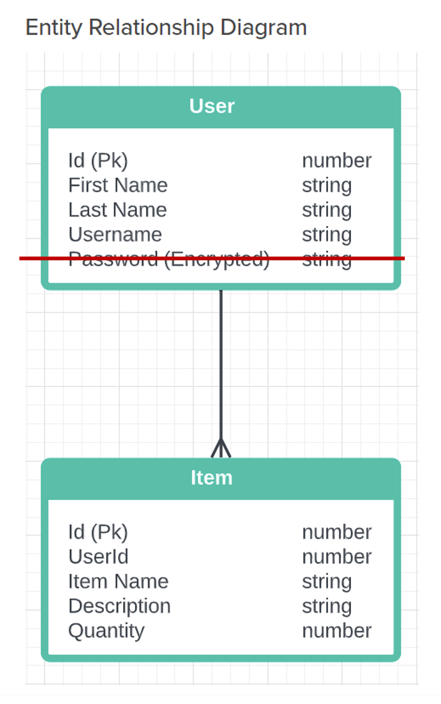

# Z-Prefix---CRUD-Project

WELCOME TO INVENTORY APP!!
DURAND PARK github ID: dpark93

**Normally the api key in the firebase.js would be hidden under .env but to not risk any form of issues during submission it is in the file**

**ONCE YOU LOG IN LOGOUT IS ON THE TOP RIGHT!!!**

STARTUP:

OPTION 1: Docker Compose
This is the easiest method to start testing the website
1) Make sure you open up Docker Desktop
2) In the root folder where docker-compose.yaml exists, just type docker-compose up  || docker-compose up -d if you want it to run in the background
    **It should build for about 200s or less when you see webpack complete then you can start going to the site
3) go to Localhost:8081/users or Localhost:8081/inventory to see if all the seeded datas exist
4) go to localhost:3000/ to begin exploring the website!

OPTION 2: Manual set up: !! IF DOCKER COMPOSE UP does not work for some reason you can manually set it up to run it
0) !!!cd into backend and inside the knexfile, change the host: 'database' under connection to host: '127.0.0.1'      !!!Make sure to do this!!!
1) in the root folder type: npm install
2) go to backend folder type: npm install
3) go to frontend folder type: npm install
4) start docker desktop
5) in your favorite wsl terminal type: docker pull postgres (if you have not already done this before)
6) when pull completes type: docker run --rm --name pg-docker -e POSTGRES_PASSWORD=docker -d -p 5432:5432 -v $HOME/docker/volumes/postgres:/var/lib/postgresql/data postgres
    ** This will run your postgres container
7) type: docker ps -a , to see your container ID
8) type: docker exec -it <container ID> bash 
    *exec into your container
9) inside the container type: psql -U postgres
    *logging into database as postgres user
10) type: CREATE DATABASE inventory
    *overall just creating inventory database in your container

11) back in your vscode terminal cd into backend
12) type in order: npx knex migrate:latest , npx knex seed:run
    *you should see tables migrate and seeds migrated
13) in your backend folder type: npm start
14) open another terminal and cd into frontend
15) type: npm start

16) Everything should start up fine!
        go to Localhost:8081/users or Localhost:8081/inventory to see if all the seeded datas exist
        go to localhost:3000/ to begin exploring the website!

IF FOR SOME REASON BOTH OPTIONS DO NOT WORK PLEASE CONTACT 
Durand Park SDI 21 in Slack
d.park.official@gmail.com

Functions:

    Login Page:
        1) Here you can login or checkout visitor's page without loging in. visitors page won't let you add, edit or delete anything just view and filter by username on the first column

        2) if you want to login using provided credential try:
            email: zprefixadmin@gmail.com
            password: sdi21rocks

        3) even if you try to go to the routes directly it will not let you. for example http://localhost:3000/Inventory, http://localhost:3000/ will redirect you to login page if you haven't logged in.
            **/Details page will error, please do not go there directly. It is a future goal to block that link**

        4) Click on Register to register for new account

    Register Page:
        1) You can choose to make your own account. This apps authentication is based on firebase and is stored in the firebase database. 
        
        2) You must provide Email, Password, Password Retype, and Username. Your First Name and Last Name is optional although if you don't provide it it won't show up on main page

        3) Once you Click register you'll be redirected to the Login Page to try out your new account!

        4) There is back to login link to go back to login page

        5) You can't use username that already exists

    Main Page:
        1) You'll see a welcome message with your username, email and first/last name if you provided the information. 

        2) At the nav bar you'll see two simple links, One to take you back to Current Main Page and Inventory where FULL CRUD Inventory functionality lives

        3) There is a logout button at the top right as well to log you out preventing user from accessing these two pages when logged out.

    Inventory Page:
        1) This is a full functioning CRUD APP. When User registers and logs in, the app fetches the username from the postgres database. This means that when you add items, the items will be added under your Username

        2) You can see the username | Item | Description | quantity | delete button in the table

        3) Each Item has their own edit button to change any mistake

        4) You can filter by username on the first column title to just see items added by specific users. You are under admin if you logged in with provided credential

        5) If you click on the item name itself it will take you to details page

        6) Description displays first couple strings and is expandable by dragging the bottom right corner horizontally to however size you please

    Details Page:
        1) Very simple Details page. This page can potentially include more information with further development. For now its just a more detailed page for each items and back to Inventory button at the top!

ERD: Only Change that has been made is the password column. Since I am using firebase, there was no need for that column. Everything else is the same

